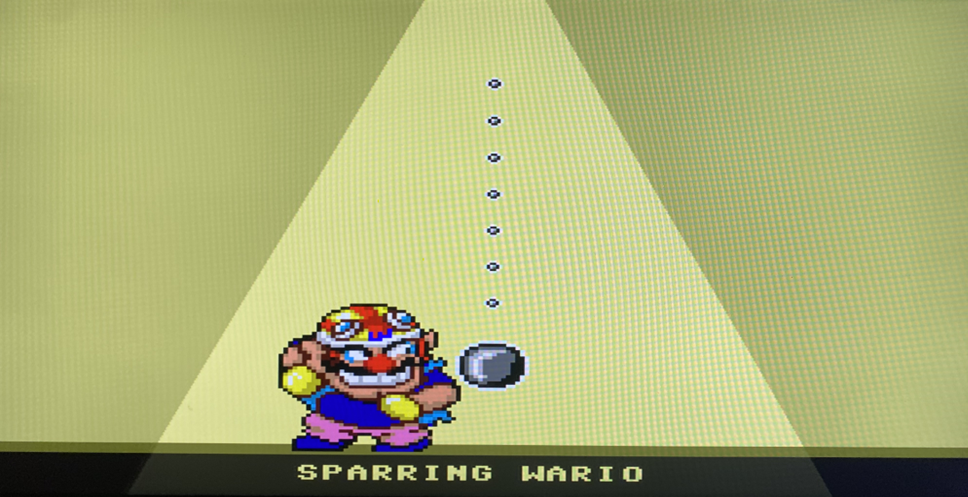
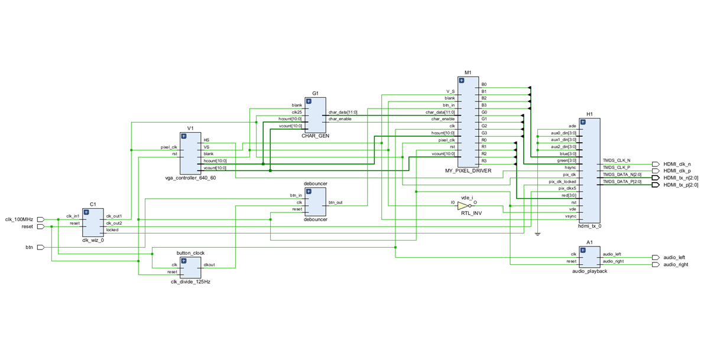

# Sparring Wario - FPGA Game (VHDL)

## Overview
This proejct is a hardware-implemented replica of the Sparring Wario minigame. The game is designed and deployed on a Xilinx Spartan-7 FPGA board using VHDL.

The game features real-time video output, input handling, and audio generation. These features have all been implemented in hardware with a soft-core processor.

## Target Hardware
- FPGA: Spartan-7 Board
- Toolchain: Xilinx Vivado
- Display: HDMI
- Audio: PWM audio from the on-board amplifier

## Architecture
- Top-level module controls video timing, game state, input, and output
- Finite state machine controls gameplay logic
- VGA controller generates synze and pixel timing
- Audio module generates background soung via PWM

## Asset Generation
- Audio samples were converted into VHDL ROMs for PWM playback using the custom Python script ('tools/audio_converter.py')
- Sprite images were converted into VHDL ROMs for pixel rendering using the custom Python script ('tools/image_alpha.py)

## Verification
- Due to time constraints, validation was done mostly on hardware
- Looking into including module-level test benches

## Key Features
- Fully synchronous VHDL design
- Modular architecture (video, game logic, input, audio)
- Finite state machine-driven gameplay
- Real-time VGA output
- Hardware-based audio generation

## Notes
- All files were designed and implemented by the author **except**:
    - 'vga_controller_640_60.vhd'
    - 'ip files were Vivado generated'

